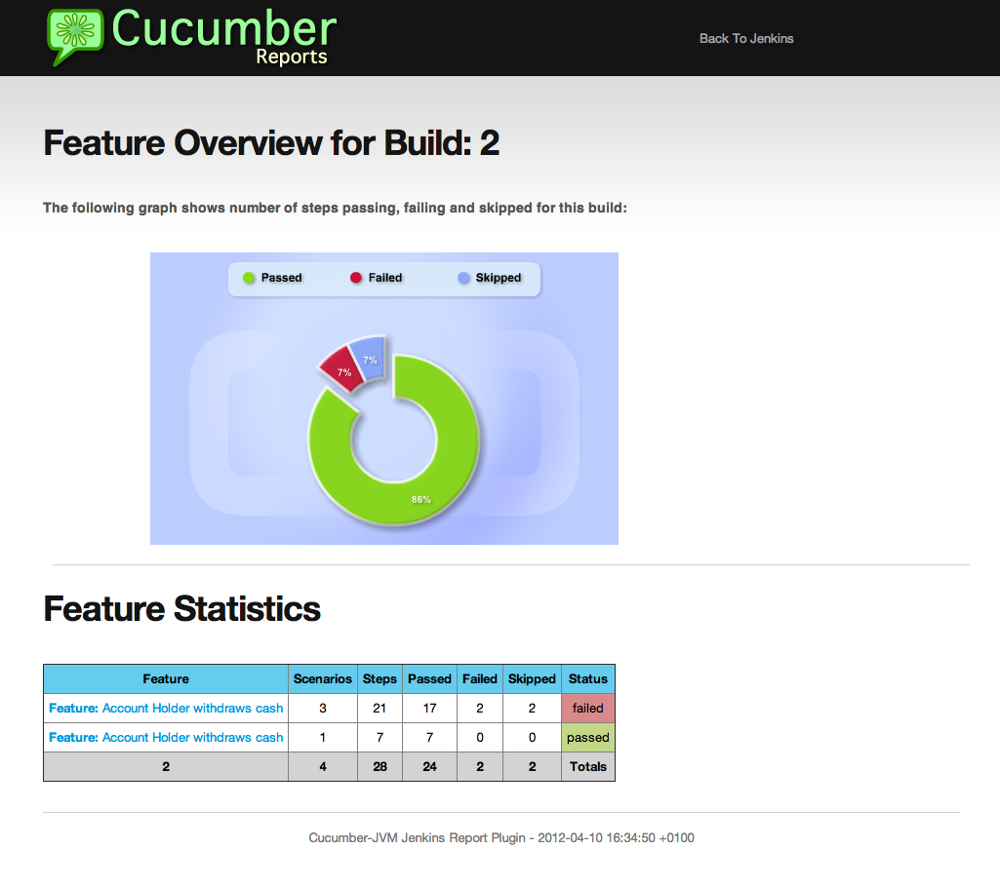
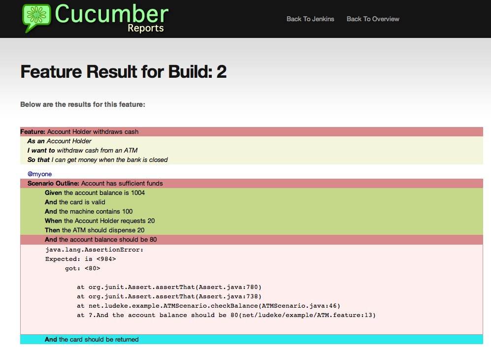

#Intro
Zucchini is a set of extensions to the [cucumber-jvm](https://github.com/cucumber/cucumber-jvm) [Behavior-driven Development](http://en.wikipedia.org/wiki/Behavior-driven_development) framework. These extensions make it significantly easier to use the popular BDD framework.

[Cucumber](http://cukes.info/) lets software development teams describe how software should behave in plain text. The text is written in a [business-readable domain-specific language](http://www.martinfowler.com/bliki/BusinessReadableDSL.html) and serves as documentation, automated tests and development-aid - all rolled into one format.

Merchant Warehouse’s zucchini framework offers tighter integration with the [Java programming language](http://www.java.com/en/) and the [JUnit testing framework](http://junit.org/), providing developers and testers alike with a much more natural programming experience. We love Cucumber, but it very much feels like a Ruby framework ported to Java. Like square pegs and round holes, things don't quite fit together. That is, until you've tried zucchini.

Some of zucchini’s notable features include:
* Better integration with JUnit. JUnit’s [@BeforeClass](http://junit.sourceforge.net/javadoc/org/junit/BeforeClass.html) and [@AfterClass](http://junit.sourceforge.net/javadoc/org/junit/AfterClass.html) annotations work. JUnit's [@Before](http://junit.sourceforge.net/javadoc/org/junit/Before.html) and [@After](http://junit.sourceforge.net/javadoc/org/junit/After.html) annotations also work, allowing you to choose to use them or Cucumber's equivalent annotations.
* Tight coupling between [Gherkin](https://github.com/cucumber/cucumber/wiki/Gherkin) feature files and your JUnit test classes. Bind your JUnit test class to one or more feature files as you please. No longer do you have to worry about Cucumber’s dreaded “duplicate step definitions found” error.
* Also, with zucchini, you can bind any arbitrary JUnit class to any Gherkin feature file(s). This makes it easy to reuse & share test cases. This is extremely helpful when using [IoC containers](http://en.wikipedia.org/wiki/Inversion_of_control), such as [Spring](http://spring.io/).
* Object inheritance works. You can define your step definitions in a base class and inherit them in child classes.
* No need for empty JUnit test runner classes. Declare your @Cucumber annotation right on your step definition files.
* Get HTML and JSON outputs by default, for easy integration into your [CI systems](http://en.wikipedia.org/wiki/Continuous_integration), such as [Jenkins](http://jenkins-ci.org/).

With Merchant Warehouse’s zucchini, behavior driven development in Java is easy.

#How it works

Zucchini is API-compatible with cucumber-jvm. This means that if your testing team is already using Cucumber, making the switch to zucchini should be as easy as pie. All you have to do is:
- Pull in zucchini AND cucumber 1.1.x into your Maven POM.
- In your JUnit test files, import zucchini instead of cucumber.
- Profit.

# Documentation

Because zucchini is API-compatible with Cucumber, you can learn how to use it by reading up on [Cucumber’s documentation](http://cukes.info/platforms.html). Please see our Examples section below for how zucchini deviates ever so slightly from Cucumber.

#Examples

Below is a sample Gherkin feature file. It defines a very basic calculator with only an "add" function. In this scenario, we are using Gherkin's "Scenario Outline" syntax. This allows us to define a data-driven test:

```cucumber
Feature: Adding two numbers together
   As a calculator
   In order to sum numbers
   I want to be able to to add

   Scenario Outline: Adding numbers together
      Given two integers <a> and <b>
      When you add them together
      Then the total should be <total>

      Examples:
         |a|b|total|
         |1|2|3|
         |4|5|9|
```

And below is the Java code that implements the feature (aka the "step definitions"). The example also shows that step definitions can be inherited by child classes. The @Cucumber.Options tag is optional - by default, zucchini will look for a Gherkin feature file with the same name as your JUnit test class.

```java
public class InheritanceTestBase {

    private int a;
    private int b;
    private int total;

    @Given("^two integers (\\d+) and (\\d+)$")
    public final void given_two_integers(final Integer a, final Integer b) {
        this.a = a;
        this.b = b;
    }

    @When("^you add them together$")
    public final void when_you_add_them_together() {
        total = a + b;
    }

    public final Integer getTotal() {
        return total;
    }
}

@RunWith(Zucchini.class)
@Zucchini.Options(features = "DifferentlyNamedFeature.feature")
public class GlueClassNamedDifferentlyThanTheFeatureFileTest extends InheritanceTestBase {

    @Then("^the total should be (\\d+)$")
    public void then_the_total_should_be(Integer total) {
        assertEquals("total", total, getTotal());
    }
}
```

## Unit tests

Looking at our unit tests is always a good way to learn how to use zucchini. Please see the following for some hands-on examples:

* [Zucchini + Junit examples](src/test/java/com/merchantwarehouse/zucchini)
* [Gherkin examples](src/test/resources/com/merchantwarehouse/zucchini)

#Example output

Like Cucumber, zucchini integrates nicely into a variety of visualization tools, such as Jenkins. Any tool that understands Cucumber's output should understand zucchini's too. There are a number of tools to visualize Cucumber's results, including:

* https://github.com/masterthought/jenkins-cucumber-jvm-reports-plugin
* https://wiki.jenkins-ci.org/display/JENKINS/Cucumber+Test+Result+Plugin

## Cucumber feature overview


## Cucumber feature results

 
 
# Downloading / Installation
Currently, Merchant Warehouse’s zucchini is only available as a source download. If you’d like to provide a Maven package, that'd be very welcome.

#Contributing
We love contributions! Please send [pull requests](https://help.github.com/articles/using-pull-requests) our way. All that we ask is that you please include unit tests with all of your pull requests.

#Getting help
We also love bug reports & feature requests. You can file bugs and feature requests in our Github Issue Tracker. Please consider including the following information when you file a ticket:
* What version you're using
* What command or code you ran
* What output you saw
* How the problem can be reproduced. A small Visual Studio project zipped up or code snippet that demonstrates or reproduces the issue is always appreciated.

You can also always find help on the [zucchini Google Group](https://groups.google.com/forum/#!forum/zucchini-bdd).
